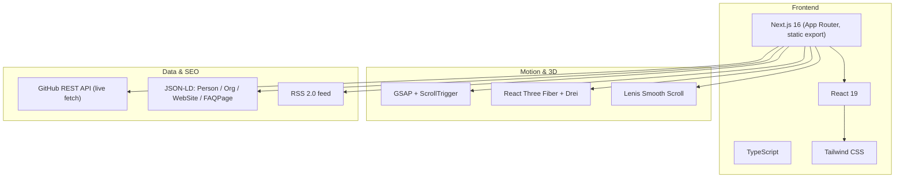
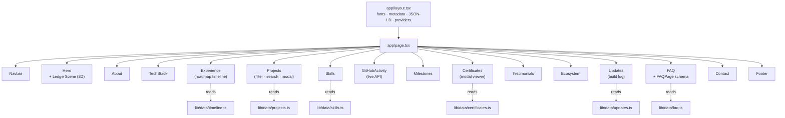
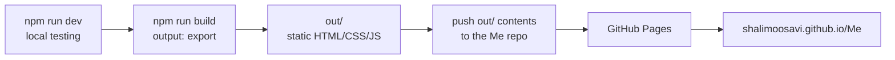

<div align="center">


<a href="https://shalimoosavi.github.io/Me/">
  
</a>

<br/>

[](https://shalimoosavi.github.io/Me/)
[](https://www.linkedin.com/in/syed-ali-hasan-moosavi-3b13782a7)
[](https://github.com/SHalimoosavi)
[](https://x.com/SHAliMoosavi)


</div>

<br/>

## Overview

The interactive portfolio site for **Syed Ali Hasan Moosavi** — AI Engineer, Full-Stack Developer,
Blockchain Developer, and Founder & Managing Director of **SAYANJALI NEXUS PRIVATE LIMITED**.

Every project, certificate, test count, and quote on this site is sourced from real, live repositories
and issued credentials — nothing here is placeholder copy. Where a fact wasn't verifiable (a fabricated
release date, an invented certification), it was deliberately left out rather than filled in.

<div align="center">

</div>

## Table of Contents

- [Features](#-features)
- [Tech Stack](#-tech-stack)
- [Architecture](#-architecture)
- [Project Structure](#-project-structure)
- [Getting Started](#-getting-started)
- [Deployment](#-deployment--github-pages)
- [SEO, AEO & GEO](#-seo-aeo--geo)
- [Changelog](#-changelog)
- [Roadmap](#-roadmap)
- [Connect](#-connect)

<br/>

## ✨ Features

| | |
|---|---|
| 🎬 **Cinematic loading screen** | Ledger-sync progress animation, reduced-motion aware |
| 🌌 **3D hero scene** | React Three Fiber "ledger network" — floating nodes on chained edges |
| 🖱️ **Magnetic cursor** | Custom dot + ring cursor, desktop fine-pointer only |
| 🧈 **Lenis smooth scroll** | Synced to GSAP ScrollTrigger for scroll-driven reveals |
| 🗂️ **Filterable project grid** | Search + category filters, 3D tilt cards, accessible modal |
| 🏅 **Real certificates** | 7 issued credentials, cropped from source images, verify links included |
| 📡 **Live GitHub activity** | Client-fetched from the public GitHub REST API — real numbers, real loading/error states |
| 📰 **Build log + RSS** | Real shipped-release feed at `/rss.xml`, no fabricated dates |
| ❓ **FAQ with schema** | Real Q&A, `FAQPage` JSON-LD for AI search engines |
| ♿ **WCAG-minded** | Skip link, focus rings, `prefers-reduced-motion` handling throughout |

<br/>

## 🧠 Tech Stack



<br/>

## 🏗️ Architecture



<br/>

## 📁 Project Structure

```
portfolio/
├── app/
│   ├── layout.tsx        # metadata, JSON-LD, fonts, providers
│   ├── page.tsx           # section assembly
│   ├── globals.css        # design tokens, glass/noise/reduced-motion utilities
│   ├── manifest.ts        # PWA manifest (basePath-aware)
│   ├── robots.ts          # robots.txt
│   ├── sitemap.ts         # sitemap.xml
│   └── rss.xml/route.ts   # RSS feed, generated from lib/data/updates.ts
├── components/
│   ├── layout/            # Navbar, Footer, LoadingScreen, CustomCursor, SmoothScrollProvider
│   ├── sections/           # one file per page section
│   ├── ui/                 # ProjectCard/Modal, CertificateModal, FAQAccordion
│   └── three/               # LedgerScene.tsx (R3F hero scene)
├── lib/
│   ├── data/                # projects, certificates, skills, timeline, updates, faq, site config
│   ├── base-path.ts         # single source of truth for the GitHub Pages "/Me" subpath
│   ├── fonts.ts              # Fraunces / Inter / JetBrains Mono via next/font
│   └── utils.ts               # cn() classname helper
└── public/
    ├── certificates/           # real certificate images (cropped from source)
    ├── favicon.svg, og-image.png, icon-*.png
    └── .nojekyll                # required — GitHub Pages ignores _next/ without this
```

<br/>

## 🚀 Getting Started

```bash
npm install
npm run dev        # http://localhost:3000/Me
```

```bash
npm run typecheck  # tsc --noEmit
npm run lint        # eslint
npm run build         # static export → out/
npm run preview        # serve the exported out/ folder locally
```

> **Coming from a previous install?** If you pulled this after the React 19 / `@react-three/fiber` fix,
> run `rm -rf node_modules package-lock.json .next` before `npm install` — the major version bump won't
> apply to an existing `node_modules`.

<br/>

## 🌐 Deployment — GitHub Pages

This app builds to a fully static `out/` directory (`output: "export"` in `next.config.ts`) because GitHub
Pages has no Node server. It's configured for a **project site** at `shalimoosavi.github.io/Me/`, not a
domain root — see `lib/base-path.ts`.



Checklist before every deploy:

- [ ] `public/.nojekyll` exists (empty file — stops Jekyll from deleting `_next/`)
- [ ] `lib/data/site.ts` → `SITE.url` matches the live domain
- [ ] `npm run build` completes with no errors, `out/` is populated
- [ ] Contents of `out/` (not the folder itself) are at the repo root Pages serves from

<br/>

## 🔍 SEO, AEO & GEO

<details>
<summary><strong>Structured data implemented</strong> (click to expand)</summary>
<br/>

| Type | Where | Purpose |
|---|---|---|
| `Person` | `app/layout.tsx` | Identity, role, `hasCredential` (real certificates) |
| `Organization` | `app/layout.tsx` | SAYANJALI NEXUS PRIVATE LIMITED |
| `WebSite` + `SearchAction` | `app/layout.tsx` | Site-level entity, search action |
| `ProfilePage` | `app/layout.tsx` | Links the page to the Person entity |
| `FAQPage` | `components/sections/FAQ.tsx` | Real Q&A, eligible for AI Overview / rich results |

</details>

- **AEO** (answer-engine optimization): semantic HTML, answer-first FAQ copy, `FAQPage` schema
- **GEO** (generative-engine optimization): entity-first writing, real `hasCredential` verify links so
  Google AI Overview / Perplexity / Copilot can attribute claims to a checkable source
- Full metadata API: Open Graph, Twitter Cards, canonical URLs, keywords, `robots.txt`, `sitemap.xml`,
  `manifest.webmanifest` — all basePath-aware for the `/Me` subpath

<br/>

## 📜 Changelog

<details>
<summary><strong>Latest — GitHub Pages subpath support</strong></summary>
<br/>

- `SITE.url` set to the real production domain: `https://shalimoosavi.github.io/Me`
- Added `output: "export"` + `basePath` to `next.config.ts`; removed `headers()`/`redirects()`
  (unsupported under static export)
- All metadata asset paths (favicon, OG image, manifest, canonical) now `/Me`-prefixed
- `package.json`: `next start` → `preview` script (static export has no server to start)

</details>

<details>
<summary><strong>Certificates & Recognition batch</strong></summary>
<br/>

- 7 real certificates built from uploaded images: **AI for Data Analysis** (Google/Coursera),
  **Prompt Engineering for ChatGPT** (Vanderbilt/Coursera), **AI Fundamentals** (IBM SkillsBuild),
  **AI Fluency: Framework & Foundations** (Anthropic), **Claude 101** (Anthropic), plus two recognition
  awards — Saudi Aramco and Mowasalat / FIFA World Cup Qatar 2022
- Dates and verify links included **only** where actually printed on the certificate
- Real `hasCredential` entries added to the `Person` JSON-LD schema

</details>

<details>
<summary><strong>React 19 / React Three Fiber fix</strong></summary>
<br/>

- Fixed a runtime crash (`Cannot read properties of undefined (reading 'ReactCurrentOwner')`) caused by
  `@react-three/fiber` v8 reaching into React internals restructured in React 19
- Bumped to `@react-three/fiber@^9`, `@react-three/drei@^10`, `three@^0.171`
- Added real icon/OG assets — no more 404s
- Resume buttons point at LinkedIn until a real PDF is supplied (`SITE.resumeUrl`)

</details>

<details>
<summary><strong>Section batch — Tech Stack, GitHub Activity, Milestones, Testimonials, Updates, FAQ, RSS</strong></summary>
<br/>

- **Tech Stack**: infinite marquee, grouped by role, pauses on hover, reduced-motion aware
- **GitHub Activity**: live client-fetched stats from the public GitHub REST API — real loading/error states
- **Milestones**: checkable shipped-code metrics (test counts, repo counts)
- **Testimonials**: real quotes already published on the SYJ Educate site
- **Updates**: real release/build-log feed, deliberately without fabricated dates
- **FAQ**: real Q&A + `FAQPage` JSON-LD
- **RSS feed** at `/rss.xml`

</details>

<details>
<summary><strong>Initial build</strong></summary>
<br/>

- Design-token system (dark "ledger" theme), full metadata API, loading screen, magnetic cursor,
  Lenis smooth scroll, 3D hero scene, About, Experience timeline, Projects grid, Skills, Ecosystem, Contact

</details>

<br/>

## 🗺️ Roadmap

- [ ] Real resume PDF at `/public/resume.pdf` (`SITE.resumeUrl` currently points to LinkedIn)
- [ ] GSAP scroll-reveal consistency pass on About / Ecosystem sections
- [ ] Additional certificates as they're issued

<br/>

## 🤝 Connect

<div align="center">

[](mailto:cto@sayanjalinexus.com)
[](https://wa.me/918008123605)
[](https://shalimoosavi.github.io/SAYANJALI_NEXUS/)

**Hyderabad, Telangana, India** · Mon–Sat, 9 AM–7 PM IST

</div>

<div align="center">
<sub>© 2026 SAYANJALI NEXUS PRIVATE LIMITED. Source is private to Syed Ali Hasan Moosavi — not licensed for reuse.</sub>
</div>


